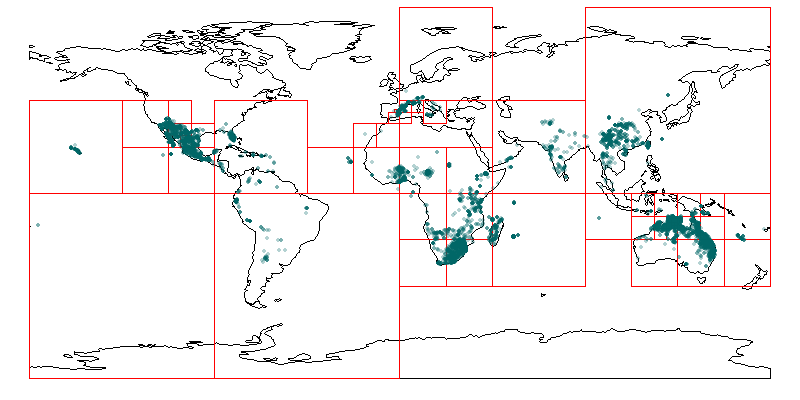

# GBIFhandleR - A simple R package to obtain and handle GBIF species observations

This R package provides basic functionalities to download and process species observations from GBIF.

# Examples

## Install package
This package is not on CRAN. It must be installed directly from GitHub, which requires `devtools`.

If `devtools` is not available on your system, please run
```r
install.packages("devtools")

```
before attempting to install this package from GitHub. To install this package, run the following line:

```r
devtools::install_github("ManuelPopp/GBIFhandleR")

```

## Download species observations
First, we search for observations of the species of interest on GBIF. The functions automatically try to resolve taxon names. Input name as well as the name matches with the GBIF backend are both stored in the output along with observation data.

```r
require("GBIFhandleR")

dir_obs <- file.path(tempdir(), "obsfiles")

dir.create(dir_obs, showWarnings = FALSE)

species_names <- c(
  "Tragopogon dubius", "Grewia rogersii", "Heteropogon contortus"
  )

for (species in species_names) {
  dst <- file.path(dir_obs, paste0(species, ".csv"))
  obs <- GBIFhandleR::get_observations(species)
  GBIFhandleR::save_observations(obs, filename = dst)
}

```
Since GBIF limits the number of observations returned, `GBIFhandleR` creates a grid and sends multiple queries. For as long as the number of observations in a grid cell is larger than the maximum returned observations, respective grid cells are subdivided. (Check the function documentation to set the minimum cell size for your project.)
Both grid and observations can be plotted:

```r
GBIFhandleR::plot.gbif(obs)

```


## Clean coordinates
GBIF data may contain observations of species that are cultivated, e.g. in a botanical garden. In most cases, such observations are unwanted. `GBIFhandleR` runs `CoordinateCleaner` under the hood to remove such observations.

```r
dir_cln <- file.path(tempdir(), "cleaned")
files <- list.files(dir_obs, pattern = ".csv", full.names = TRUE)

for (file in files) {
  obs <- GBIFhandleR::load_observations(file)
  
  cleaned <- GBIFhandleR::clean_coords(
    obs$data, species_column = "scientificName"
  )
  
  obs[["data"]] <- cleaned
  
  GBIFhandleR::save_observations(
    obs,
    file.path(dir_cln, basename(file))
  )
}

```

## Assign native/introduced status to the observations
It might be of interest whether an individual or a population observed at a given place is considered native or introduced at that location. To obtain such information, we can query [Plants of the World Online (POWO)](https://powo.science.kew.org/). It uses the [World Geographical Scheme for Recording Plant Distributions (WGSRPD)](https://www.tdwg.org/standards/wgsrpd/) standard.

```r
species <- obs$gbifname
sp_range <- GBIFhandleR::get_range(species)

```

We can plot the places where the taxon is considered native or introduced by simply running:
```r
plot(range)

```


Let's assign native/introduced status to the locations of observed individuals/populations...
```r
locations <- assign_status(observations, range)

```
